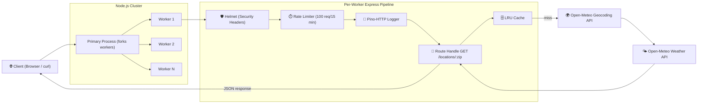

```mermaid
flowchart LR
  Client["🌐 Client (Browser / curl)"]

  subgraph Cluster["Node.js Cluster"]
    Primary["Primary Process (forks workers)"]
    W1["Worker 1"]
    W2["Worker 2"]
    WN["Worker N"]
  end

  subgraph Pipeline["Per-Worker Express Pipeline"]
    Helmet["🛡️ Helmet (Security Headers)"]
    RateLimit["⏱️ Rate Limiter (100 req/15 min)"]
    Logger["📝 Pino-HTTP Logger"]
    Handler["📍 Route Handle GET /locations/:zip"]
    Cache["🗄️ LRU Cache"]
  end

  GeoAPI["🌍 Open-Meteo Geocoding API"]
  WeatherAPI["🌤️ Open-Meteo Weather API"]

  Client --> Primary
  Primary --> W1 & W2 & WN
  W1 --> Helmet
  Helmet --> RateLimit
  RateLimit --> Logger
  Logger --> Handler
  Handler --> Cache
  Cache -->|miss| GeoAPI
  GeoAPI --> WeatherAPI
  WeatherAPI --> Handler
  Handler -->|JSON response| Client
```
