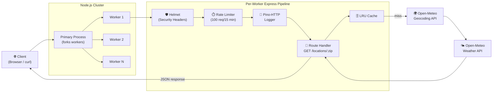

```mermaid
flowchart LR
  Client["🌐 Client<br>(Browser / curl)"]

  subgraph Cluster["Node.js Cluster"]
    Primary["Primary Process<br>(forks workers)"]
    W1["Worker 1"]
    W2["Worker 2"]
    WN["Worker N"]
  end

  subgraph Pipeline["Per-Worker Express Pipeline"]
    Helmet["🛡️ Helmet<br>(Security Headers)"]
    RateLimit["⏱️ Rate Limiter<br>(100 req/15 min)"]
    Logger["📝 Pino-HTTP<br>Logger"]
    Handler["📍 Route Handler<br>GET /locations/:zip"]
    Cache["🗄️ LRU Cache"]
  end

  GeoAPI["🌍 Open-Meteo<br>Geocoding API"]
  WeatherAPI["🌤️ Open-Meteo<br>Weather API"]

  Client --> Primary
  Primary --> W1 & W2 & WN
  W1 --> Helmet
  Helmet --> RateLimit
  RateLimit --> Logger
  Logger --> Handler
  Handler --> Cache
  Cache -->|miss| GeoAPI
  GeoAPI --> WeatherAPI
  WeatherAPI --> Handler
  Handler -->|JSON response| Client
```
