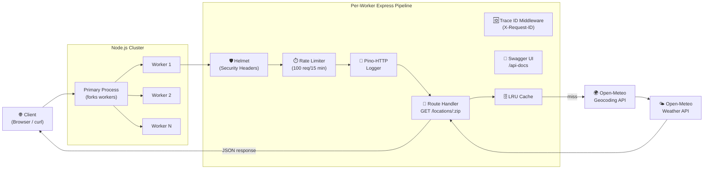
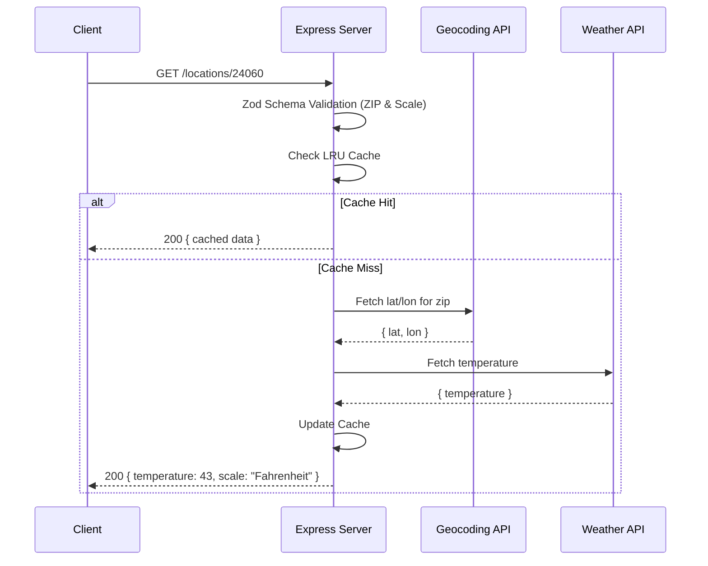

# 🌤️ Weather API (ZIP → Current Temperature)

A production-minded **Express + TypeScript** API that returns the **current temperature** for a given **5-digit U.S. ZIP code**. Built for the Virginia Cyber Range Development Intern Challenge.

 **Meets the challenge contract:**
- `npm install` then `npm start`
- Server runs at `http://localhost:8080`
- Route: `GET /locations/:zip`
- Response JSON: `{ "temperature": 43, "scale": "Fahrenheit" }`

---

## ✨ Key Features

-  Single required endpoint: `GET /locations/:zip`
- Schema-Driven Validation (Zod): Bulletproof input handling for ZIPs and Scales using `zod`.
- External data provider: [Open-Meteo](https://open-meteo.com/) (No API key required).
-  Performance & Reliability:
    - LRU Cache: For hot ZIP + scale lookups (10-minute TTL).
    - Rate Limiting: Prevents abuse (100 req/15 min).
    - Node.js Clustering: Multi-core utilization for high availability.
    - Graceful Shutdown: Handles process signals (`SIGTERM`/`SIGINT`) to finish pending requests before exiting.
    -   Health Checks: `/health` endpoint for monitoring and orchestration.
-  Observability: Structured JSON logging via `pino-http` and centralized error handling for consistent API responses.
- Testing: 100% passing integration tests using `Jest` + `Supertest`.
- Docker Ready: Support for containerized deployment with included `Dockerfile` and `Makefile`.

---

## � Quick Start

### 1. Prerequisites
- Node.js >= 20
- npm

### 2. Installation
```bash
npm install
```

### 4. Test (Verified Integrity)
```bash
npm test
```

---

## 📌 API Usage

### Get Temperature by Location
**Endpoint:** `GET /locations/:zip`

**Query Params:**
- `scale` (optional): `Fahrenheit` (default) or `Celsius` (case-insensitive).

#### Examples:

| Goal | Command |
| :--- | :--- |
| **Default (Fahrenheit)** | `curl http://localhost:8080/locations/24060` |
| **Celsius** | `curl "http://localhost:8080/locations/90210?scale=Celsius"` |
---

## 🏗️ System Architecture



---

## 🔄 Flow of Execution



---

## 🧪 Testing

This project uses **Jest + Supertest** for route-level integration tests.

**Coverage includes:**
-  Valid ZIP returns 200 and a numeric temperature.
-  Default scale defaults to Fahrenheit.
-  Scale override correctly returns Celsius.
-  Invalid ZIP formats (non-numeric, wrong length) return 400.
-  Unknown ZIP (geocoding miss) returns 404.
- Invalid scale parameters return 400.

**Run tests:**
```bash
npm test
```

---

## 🔄 CI (GitHub Actions)

A workflow runs on every push and pull request to the `main` branch. It automatically installs dependencies and runs `npm test` to ensure code integrity.
- **Workflow location:** `.github/workflows/ci.yml`

---

## 📐 Design Rationale

- **Why Open-Meteo?** I believe this is the best choice because no API keys required means reviewers can run the app instantly without creating accounts or setting up `.env` secrets. It also meant that I did not have to expose any private API keys in a public repository. 
- **Why strict validation?** Rejecting malformed input early avoids unnecessary upstream API calls and follows secure API development practices.
- **Why caching + rate limiting?** I implemented these features to  reduce external latency and preventing abuse, which is critical when relying on free public endpoints. It also prevents DDoS attacks. 
- **Why clustering?** It is to optimize system resource utilization.

---

## 🐳 Docker (Optional)

Docker is included as a production-ready extra.
```bash
docker build -t weather-api .
docker run --rm -p 8080:8080 weather-api
```

---

## 📚 References & AI Usage

- **Open-Meteo API**: [Documentation](https://open-meteo.com/en/docs)
- **Jest + Supertest**: Integration testing patterns.
- **AI Usage**: AI assistance (ChatGPT and Gemini) was used for debugging help, configuration guidance, architectural visualization, and documentation wording. Core implementation choices, endpoint logic, and final code integration were completed by the author.


