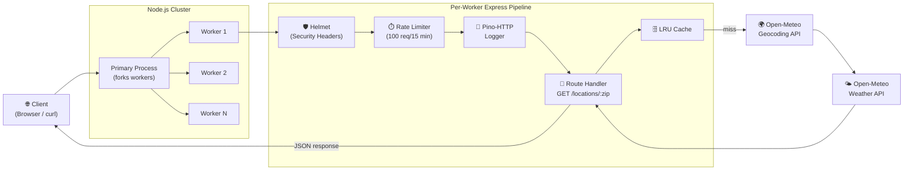
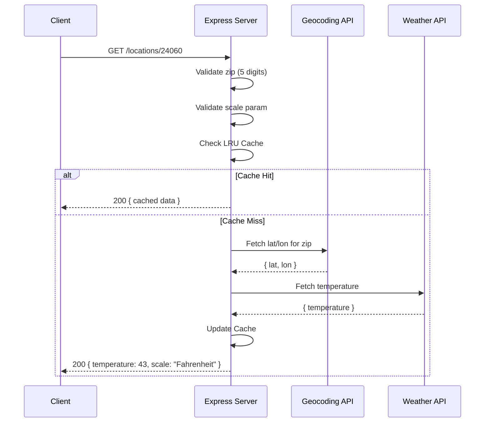

# 🌤️ Weather API - Virginia Cyber Range Intern Challenge

[](https://nodejs.org/)
[](https://opensource.org/licenses/ISC)
[](https://www.typescriptlang.org/)

A robust, production-ready weather API built with **Express** and **TypeScript**. This project provides a simple interface to fetch current temperatures by ZIP code, featuring multi-layered security, performance optimizations, and a resilient architecture.

---

## 🚀 Quick Start

### 1. Prerequisites
- [Node.js](https://nodejs.org/) (v20 or higher recommended)
- [npm](https://www.npmjs.com/)

### 2. Installation
```bash
npm install
```

### 3. Running the Application
```bash
npm start
```
The server will be available at `http://localhost:8080`.

---

## 🛠️ Features

- **📍 ZIP-to-Weather**: Converts 5-digit US ZIP codes to precise weather data using the Open-Meteo API.
- **⚡ Performance**: 
    - **In-Memory Caching**: Implements `lru-cache` to store recent requests (10-minute TTL) and reduce external API latency.
    - **Cluster Mode**: Automatically scales across all available CPU cores to handle high concurrent traffic.
- **🛡️ Security & Reliability**:
    - **Helmet**: Secures the app by setting various HTTP headers.
    - **Rate Limiting**: Protects against brute-force and DDoS (100 requests per 15-minute window).
    - **Input Validation**: Strict Regex for ZIP codes and case-insensitive scale validation.
- **📝 Logging**: Structured logging via `pino-http` for production-grade observability.
- **🧪 Testing**: Comprehensive test suite using `Jest` and `Supertest`.

---

## 📖 API Documentation

### Get Temperature by Location

Returns the current temperature for a specified ZIP code.

**Endpoint:** `GET /locations/:zip`

**Parameters:**
- `zip` (Path): A 5-digit US ZIP code.
- `scale` (Query, Optional): `Fahrenheit` (default) or `Celsius`.

#### Example Requests:

| City | Request |
| :--- | :--- |
| **Blacksburg, VA** | `GET /locations/24060` |
| **Beverly Hills, CA** | `GET /locations/90210?scale=Celsius` |
| **Chicago, IL** | `GET /locations/60606?scale=Fahrenheit` |

#### Successful Response:
```json
{
    "temperature": 43,
    "scale": "Fahrenheit"
}
```

---

## 🏗️ System Architecture



---

## 🔄 Request Lifecycle



---

## 🧪 Testing

The project includes unit and integration tests to ensure reliability.

```bash
npm test
```

We test for:
- ✅ Successful temperature retrieval (Fahrenheit/Celsius)
- ✅ Input validation (invalid ZIP formats)
- ✅ Error handling (non-existent ZIP codes)
- ✅ Case-insensitivity for query parameters

---

## 📐 Design Rationale

1.  **Framework Choice**: **TypeScript** with **Express** was chosen for its type safety and wide community support, making it ideal for maintainable production code.
2.  **External Data**: [Open-Meteo](https://open-meteo.com/) was selected as the data provider because it is free for non-commercial use, requires no API key (simplifying the setup for this challenge), and provides high-quality geocoding and weather data.
3.  **Resilience**: The use of `node:cluster` ensures that the API can utilize full system resources, while `helmet` and `express-rate-limit` provide the "Must Have" production security baseline.
4.  **Efficiency**: The geocoding step is often the bottleneck; caching ZIP-to-weather results drastically improves response times for repeated requests to the same location.

---
*Created for the Virginia Cyber Range Development Intern Challenge.*
